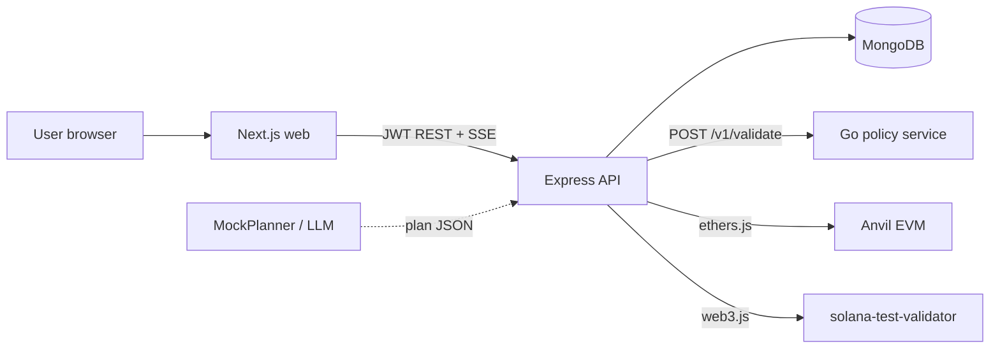

# Architecture

Guardrail Agent is a local demo stack. Natural language goes in, a structured plan comes out, Go policy says yes or no, a human approves each step, and only then does the API touch chain RPCs. Model output never becomes raw calldata or instruction bytes.

## Context

The web app is a thin client. It does not talk to chains directly. All orchestration, persistence, and signing happen in the API. Policy is a separate process so schema and rule checks are not buried inside Express route handlers.

## Service responsibilities

| Component | Role |
|-----------|------|
| **Web** (`apps/web`) | Login, compose intent, view plan steps, approve/reject, audit timeline. Reads/writes via REST. Subscribes to SSE for live step updates. |
| **Express API** (`services/api`) | Auth (email/password, optional SIWE), intent pipeline, plan CRUD, step approval, audit log, chain executors. Owns MongoDB. Calls policy on every new plan. |
| **Go policy** (`services/policy`) | Stateless HTTP service. Validates plan JSON against JSON Schema, then applies allowlists and caps from the policy document. Returns machine codes and human messages. |
| **MongoDB** | Users, refresh tokens, policy versions, intents, plans, plan steps, audit events, SIWE nonces. |
| **Anvil** | Local EVM (chain id 31337). Mock ERC-20 tokens and a swap router deployed via Foundry. API signs with a demo private key from compose env. |
| **Solana test validator** | Local Solana RPC. MVP executor supports native SOL transfer only. |

## Trust boundaries

| Zone | Trust level | Notes |
|------|-------------|-------|
| MockPlanner / LLM | Untrusted | Output is structural JSON only. Never trusted for amounts, recipients, or bytes. |
| Next.js client | Untrusted | Can be tampered with. Server re-checks ownership and plan state on every approve. |
| Express API | Trusted orchestration | Gates execution. Holds demo keys in env. If compromised, policy could be bypassed at this layer. |
| Go policy service | Trusted decisioning | Schema + rules. No chain access. |
| MongoDB | Trusted store | Not exposed publicly. Strict Mongoose schemas. |
| Anvil / Solana RPC | Local demo only | Default keys. Do not point at mainnet. |

See also [threat-model.md](threat-model.md).

## Plan schema rules

Plans live in `packages/plan-schema/plan.schema.json` and are enforced by the Go service at `/v1/validate`.

Hard constraints:

- **No raw bytes.** Steps use symbolic token names (`MOCK_USDC`, `SOL`), decimal string amounts, and allowlisted action enums. There is no field for hex calldata, contract bytecode, or serialized Solana instructions.
- **`additionalProperties: false`** on the root and every step variant. Extra keys fail schema validation.
- **Fixed chains:** `anvil`, `solana-local`.
- **Step cap:** 1 to 5 steps per plan (schema max; policy also enforces `maxSteps`).
- **Actions:** EVM supports `approve`, `transfer`, `swap`. Solana supports `transfer` only.
- **Amounts:** Decimal strings matching `^(0|[1-9][0-9]*)(\.[0-9]+)?$`. No scientific notation, no hex.

Executors (`services/api/src/executors/`) map symbolic steps to real transactions. That mapping is server-side code, not model output.

## Data model

Mongo collections (Mongoose models in `services/api/src/models/`):

| Collection | Purpose | Key fields |
|------------|---------|------------|
| `users` | Accounts | `email`, `passwordHash`, optional `evmAddress`, `solanaPubkey` |
| `refreshtokens` | Rotating refresh JWTs | `jti`, `userId`, `expiresAt`, `revokedAt` |
| `policies` | Rule documents | `scope` (`global` or user id), `version`, `rules` |
| `intents` | Raw user text | `userId`, `text`, `status`, optional `chainHint` |
| `plans` | Validated or rejected plan | `intentId`, `userId`, `chain`, `summary`, `status`, `rawModelJson`, `rejectionReasons`, `policyVersion` |
| `plansteps` | One row per step | `planId`, `index`, `action`, `payload`, `decodedSummary`, `status`, `dryRunOk`, `txHash`, `error` |
| `auditevents` | Append-only timeline | `type`, `entityId`, `userId`, `payload`, `createdAt` |
| `siwenonces` | SIWE login nonces | `nonce`, `expiresAt` |

Plans always store `rawModelJson` for debugging and audit, even when rejected.

## Stack choices

**Express + Mongo:** Deliberate for a portfolio full-stack shape. Auth, CRUD, SSE, and orchestration fit fine here. Not claiming this is the production choice for high-volume trading.

**Go for policy:** Schema compilation and rule evaluation are isolated, testable, and fast. The API stays dumb about rule details: it forwards JSON and stores the result. Policy codes (`infinite_approve`, `recipient_not_allowed`, etc.) are stable contracts for the UI and eval fixtures.

**Next.js + Tailwind:** Standard React app shell. No chain SDK in the browser.

**Foundry mocks:** Anvil ships in compose under the `full` profile. Contract addresses land in `contracts/deployments/anvil.json` after `forge script`.

**MockPlanner default:** Keyword router in `services/api/src/planner/mock.ts`. Zero API keys. LLM planner is env-gated (`PLANNER=openai`) and still goes through the same policy gate.
