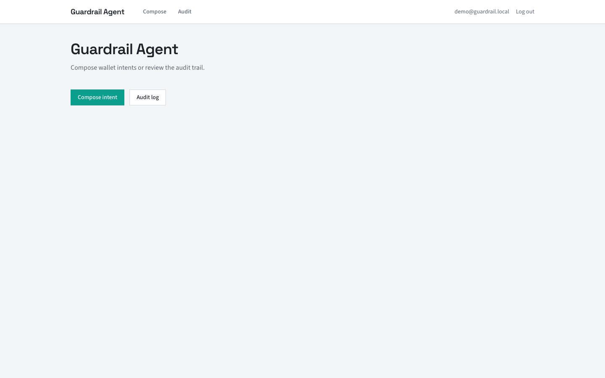
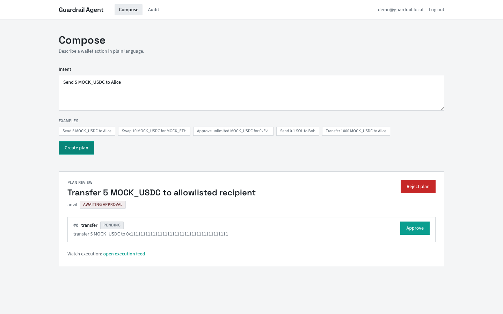
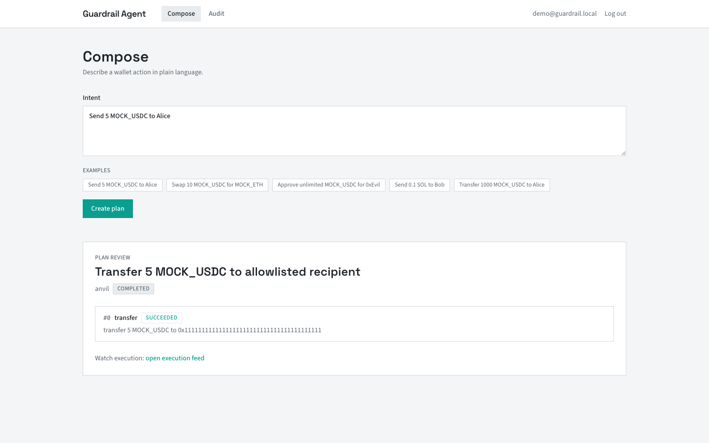
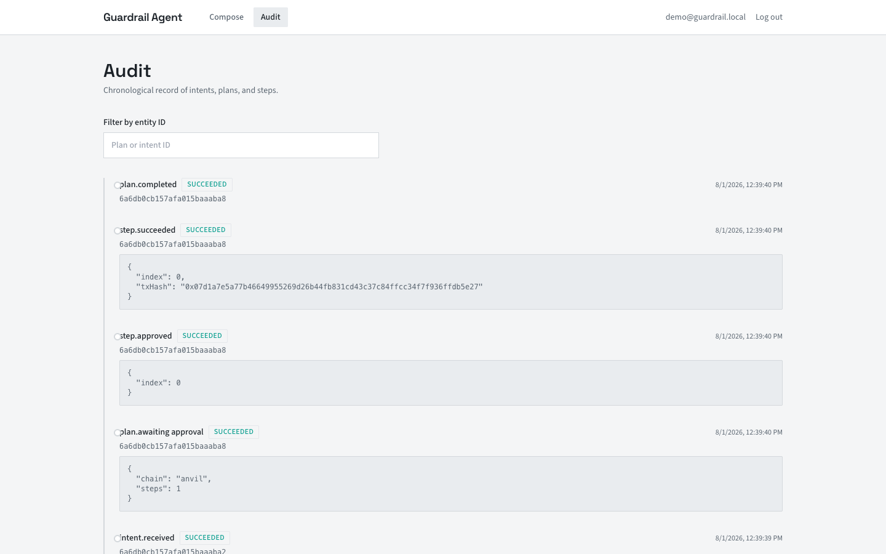

# Demo

Local-only walkthrough. Budget about three minutes for an interviewer.

## Run locally

```bash
cp .env.example .env
docker compose -f deploy/docker-compose.yml --profile full up --build
```

The `full` profile starts Anvil (8545) and solana-test-validator (8899) in addition to mongo, policy, api, and web.

**Mongo on Colima:** Compose mounts Mongo data on tmpfs (`/data/db`) to avoid WiredTiger crashes on some Colima/virtio volume setups. Data does not survive container restart. Fine for demos; re-run seed after restart.

In a second terminal, deploy mock contracts and seed the database:

```bash
cd contracts
forge install foundry-rs/forge-std --no-git
forge script script/Deploy.s.sol --rpc-url http://127.0.0.1:8545 \
  --private-key 0xac0974bec39a17e36ba4a6b4d238ff944bacb478cbed5efcae784d7bf4f2ff80 --broadcast

cd ../services/api && npm ci && npm run seed
```

Endpoints:

- Web: http://localhost:3000
- API health: http://localhost:8080/api/health
- Policy health: http://localhost:8090/healthz

## Demo user

| Field | Value |
|-------|-------|
| Email | `demo@guardrail.local` |
| Password | `demopass123` |

Created by `npm run seed`. You can register a new account instead; seed also ensures global policy v1 exists.

Demo EVM signer is Anvil account #0 (`0xf39Fd6e51aad88F6F4ce6aB8827279cffFb92266`). Not a secret locally; still do not reuse on any public network.

## Interviewer script (< 3 min)

**0:00 Login**

Open http://localhost:3000, log in as demo user. Land on Compose.

**0:20 Accept path (EVM transfer)**

- Click chip: `Send 5 MOCK_USDC to Alice`
- Submit. Plan shows one transfer step to allowlisted address `0x1111...1111`.
- Approve step 0. Point at tx hash on Anvil.
- One-liner: "Model output became JSON, policy allowlisted it, I clicked approve, API dry-ran then sent."

**1:00 Reject path (infinite approve)**

- Click chip: `Approve unlimited MOCK_USDC for 0xEvil`
- Submit. Plan status is rejected. UI shows `infinite_approve` (and human message from policy).
- One-liner: "Max-uint approve passes schema but policy blocks it. No approve button, nothing hits the chain."

**1:40 Optional: amount cap**

- Chip: `Transfer 1000 MOCK_USDC to Alice` shows `amount_over_cap` if you have time. Skip if tight.

**2:00 Solana (optional)**

- Chip: `Send 0.1 SOL to Bob`
- Approve. Show signature from local validator.

**2:30 Audit**

- Open Audit page. Filter shows `intent.received`, `plan.awaiting_approval` or `plan.rejected_policy`, `step.succeeded`, etc.
- One-liner: "Every decision is logged. Rejects are first-class, not errors."

**2:50 Close**

- Mention [threat-model.md](threat-model.md): model untrusted, local chains only, not production-ready.

## Screenshots

Captured against a local stack. Paths under `docs/demo/screenshots/`.

Regenerate (web + API up; needs system Chrome):

```bash
./scripts/terminal-demo.sh          # API transcript → docs/demo/terminal.md
node scripts/capture-demo.mjs       # UI shots as demo user
```

### Landing / auth




### Compose






### Audit



## Terminal capture

API-side accept/reject transcript (no browser): [docs/demo/terminal.md](demo/terminal.md).

## Compose chips (reference)

Seed prints these; they map to MockPlanner keywords:

| Chip | Expected outcome |
|------|------------------|
| `Send 5 MOCK_USDC to Alice` | Pass policy, approve, Anvil tx |
| `Swap 10 MOCK_USDC for MOCK_ETH` | Pass policy, single approve; executor handles router approve internally |
| `Approve unlimited MOCK_USDC for 0xEvil` | `infinite_approve` reject |
| `Send 0.1 SOL to Bob` | Pass policy, Solana transfer |
| `Transfer 1000 MOCK_USDC to Alice` | `amount_over_cap` reject |

## Troubleshooting

| Symptom | Fix |
|---------|-----|
| Mongo exits on Colima | Already on tmpfs in compose; pull latest `deploy/docker-compose.yml` |
| EVM tx fails unknown token | Re-run forge deploy; check `contracts/deployments/anvil.json` |
| Policy connection refused | Wait for policy container healthy; check `POLICY_SERVICE_URL` |
| 401 on API | Re-login; access token TTL is short |

Do not point demo keys or compose defaults at mainnet or public RPCs.
