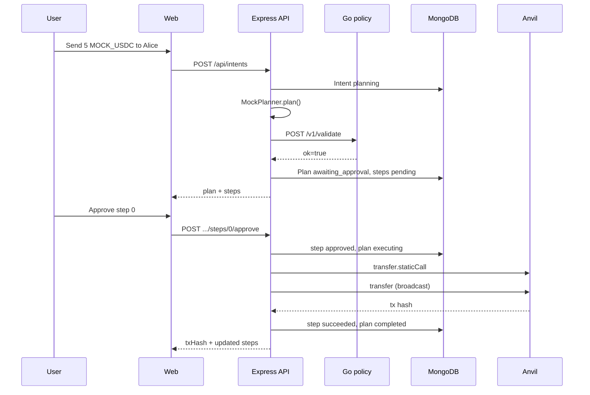

# Process

How an intent becomes a chain transaction, and where it stops.

## Happy path (EVM transfer)

1. User submits natural language on Compose (`POST /api/intents`).
2. API creates an `Intent` with status `planning`, writes `intent.received` audit event.
3. MockPlanner (or LLM) returns a plan JSON object.
4. API loads policy (user-scoped, else global, else defaults) and calls Go policy `POST /v1/validate`.
5. Schema passes, policy passes. API creates `Plan` (`awaiting_approval`) and `PlanStep` rows (`pending`). Intent moves to `planned`. Audit: `plan.awaiting_approval`.
6. User clicks Approve on step 0 (`POST /api/plans/:id/steps/0/approve`).
7. API sets step to `approved`, plan to `executing`, audit `step.approved`.
8. Step moves to `dry_running`. Executor runs `staticCall` (EVM) or `simulateTransaction` (Solana).
9. On success, step moves to `submitting`, then `succeeded` with `txHash`. Audit: `step.succeeded`.
10. If no steps remain, plan becomes `completed`, audit `plan.completed`. Otherwise plan returns to `awaiting_approval` for the next step.



Multi-step plans require sequential approval. Step N cannot run until step N-1 is `succeeded`. Note: EVM swap is one plan step; the executor performs router approve + swap inside that step.

## Reject path (infinite approve)

Same pipeline through step 4, but policy returns a code:

1. User submits something like `Approve unlimited MOCK_USDC for 0xEvil`.
2. MockPlanner emits a plan with action `approve`, token `MOCK_USDC`, and a max-uint decimal amount string. This passes JSON Schema (amount is a valid decimal string).
3. Go policy runs `forbidInfiniteApprove` and returns `infinite_approve`.
4. API sets intent to `rejected_policy`, creates a plan with status `rejected_policy`, stores codes in `rejectionReasons`. Audit: `plan.rejected_policy`.
5. No steps are created. UI shows a code-specific loud banner via `PolicyReject`. User cannot approve.

The executor also blocks infinite approve strings as a second line of defense (`infinite_approve_blocked_at_executor`), but the demo is meant to fail at policy before anyone clicks Approve.

## Reject path (bad recipient)

1. User submits `Send 5 MOCK_USDC to 0xEvil`.
2. MockPlanner emits a transfer to a non-allowlisted address.
3. Go policy returns `recipient_not_allowed`.
4. Same terminal plan status and loud UI as infinite approve — different code and headline.
5. Interview point: policy is a product with multiple first-class reject paths, not a single trick.

Other reject examples:

- `Transfer 1000 MOCK_USDC to Alice` hits `amount_over_cap` (default cap is 100).
- Wrong mint hits `mint_not_allowed`.
- Malformed plan hits `rejected_schema` with schema error paths.

## State machines

### Intent

```
received -> planning -> planned
                     -> rejected_schema
                     -> rejected_policy
                     -> planner_unavailable  (planner error or policy service down)
```

Terminal for a given intent: `planned`, `rejected_*`, or `planner_unavailable`. There is no "executing" on the intent itself; execution state lives on the plan.

### Plan

```
(awaiting_approval <-> executing) -> completed
                                  -> failed
                                  -> cancelled          (user reject)
rejected_schema / rejected_policy   (created already terminal)
```

- `executing` is brief: one step is in flight.
- After a step succeeds, plan returns to `awaiting_approval` if more steps are pending.
- `failed` when dry-run or broadcast fails; user can retry a failed step if plan is still approvable.

### Plan step

```
pending -> approved -> dry_running -> submitting -> succeeded
                                                 -> failed
pending / failed / approved / dry_running / submitting -> cancelled  (plan reject)
```

Idempotency: approving an already `succeeded` step is a no-op (`noop: true` in the API response).

## What happens on Approve

`approveStep` in `services/api/src/services/execution.ts`:

1. **Guards:** Plan owned by user, plan status approvable, step is `pending` or `failed`, previous step succeeded if index > 0.
2. **Record approval:** `step.status = approved`, `plan.status = executing`, audit `step.approved`, SSE push.
3. **Dry-run:** `step.status = dry_running`. Executor runs:
   - EVM: `Contract.staticCall` before broadcast (`evm.ts`).
   - Solana: `connection.simulateTransaction` before `sendAndConfirmTransaction` (`solana.ts`).
4. **On dry-run failure:** `step.status = failed`, `plan.status = failed`, audit `step.failed`. Stops.
5. **On dry-run success:** `step.status = submitting`, then broadcast.
6. **On broadcast success:** `step.status = succeeded`, `txHash` stored, audit `step.succeeded`.
7. **Plan rollup:** All steps done -> `plan.completed`. Else -> `awaiting_approval` for the next human click.

There is no autonomous execution path when `allowAutonomous` is false (default). Every step needs an explicit approve POST.

## Audit event types

Append-only `auditevents` collection. Filter via `GET /api/audit?entityId=...`.

| Type | When | Typical payload |
|------|------|-----------------|
| `intent.received` | Intent created | `{ text }` |
| `intent.planner_unavailable` | Planner threw | `{ error }` |
| `intent.policy_unreachable` | Policy HTTP failed | `{ error }` |
| `plan.awaiting_approval` | Plan passed validation | `{ chain, steps }` |
| `plan.rejected_schema` | Schema failed | `{ policyCodes, schemaErrors, humanMessages }` |
| `plan.rejected_policy` | Policy failed | `{ policyCodes, schemaErrors, humanMessages }` |
| `step.approved` | User approved a step | `{ index }` |
| `step.failed` | Dry-run or send failed | `{ index, error }` |
| `step.succeeded` | Step completed on chain | `{ index, txHash }` |
| `plan.completed` | All steps succeeded | `{}` |
| `plan.cancelled` | User rejected plan | `{}` |

Policy codes (not audit types, but stored in rejection payloads and plan rows): `chain_not_allowed`, `max_steps_exceeded`, `action_not_allowed`, `mint_not_allowed`, `infinite_approve`, `slippage_too_high`, `recipient_not_allowed`, `amount_over_cap`.
